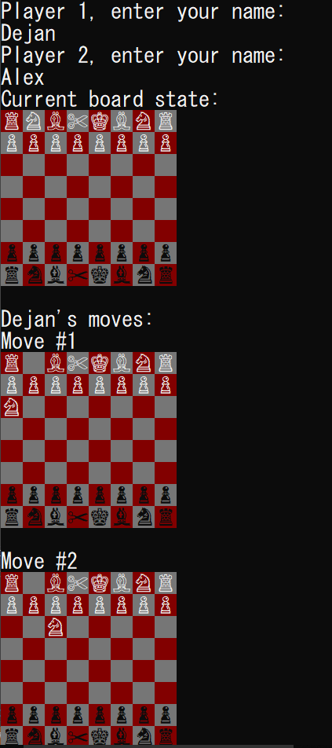
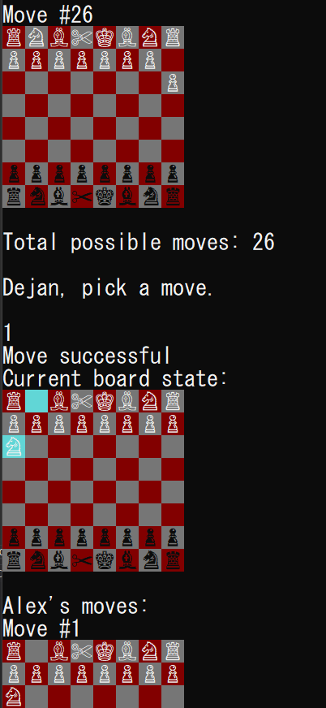

# Really Good Chess
Assigned: 2019/12/03
Due: 2019/12/12

### Part 1
I created a Scissors piece. It can move 1 block forward, including diagonals. 
It can also swap with any *team* piece that is directly neighboring. 
This is the only time it can move backwards. As far as capturing, it can only capture like a pawn (diagonally).
The unicode for white scissors ✄ is (U+2704) and for black scissors ✂ is (U+2702). 

Now, since these aren't 6 units away from each other like the other chess pieces, I just had an if/else to make sure
the right symbols were actually being printed. So in ToConsole() in Render.cs, something like
```
if(Piece is Scissors)
    Console.Write((piece.Color == Color.White) ? "✄" : "✂");
```

Otherwise, `piece.AsColoredChar());` would execute which would print whatever (U+2704) + 6 is, = 	✐. Don't want that.. although.. what if a pencil
could erase and draw a piece wherever it wanted? Maybe only 2x a match? Hmm..


*Markdown automatically renders the emoji version of black scissors into scissors, but under the code block, it shows as it would on the board.*


### Part 2

I tried to implement castling, but it's not fully working since I think it has to do with us switching X and Ys around when we were having issues with the pawn.
It should mostly be okay though. So I stopped doing castling and worked on the "human chess player." Not the actual Smart AI player, but rather letting
humans play each other. I didn't make a new Human class, so it can't play the BasePlayer (though that would be fairly easy to implement), instead it takes two humans sharing  the keyboard and playing  each other.





It prints the currrent state of the board after each move, and then for whoever's turn it is it prints their name and their possible moves. It then asks 
for input of a move, if it's valid it executes it, if it's not valid the turn goes again. For example, if there's 25 moves but the user inputs
50 for Move (board) #50, he would go again after getting a message saying "No such move #50".




I think that's pretty much it. I haven't gone through the whole game but have fun if you choose to do so. 
I also have no idea why it prints Red instead of Dark Grey..  I've tried everything.

##### Possible improvements:

- Have the Console initially prompt for Human vs CPU or Human vs Human
- Right now, we obviously have Human vs Human, could just keep that code. But if it's Human vs CPU, all you would need to do is have CPU automatically choose
a move instead of waiting for user input. We already have that in BasePlayer (probably make it prioritize captures too), so this is where that Human BasePlayer class would
probably come.
- Also Console formatting could probably change. Instead of  

[Current Board]  
[Possible  Board]  
[Possible  Board]   
...  
[Possible  Board]

Perhaps this would  be easier to read (and not lose track of previous state). I found myself scrolling up for the current state often.   
[Current Board]   [Possible  Board]  
[Current Board]   [Possible  Board]  
..  
[Current Board]   [Possible  Board]  